# Yourswelnes — Android Architecture

> Auto-generated architecture reference for the **Yourswelnes** Android app.
> Application ID: `com.yourwelnes.yourswelnes` · Namespace: `com.example.yourswelnes`
> minSdk 29 · targetSdk 36 · Kotlin + Jetpack Compose · Single-module (`:app`).

---
/Users/deviduttamishra/Desktop/yourswelnes/docs/architecture.md

## 1. Project Overview

Yourswelnes is a **100% Jetpack Compose**, single-activity Android application built on a
**feature-first Clean/MVVM architecture** with **Hilt** dependency injection. Its core purpose is
**reliable, offline-capable background GPS location tracking** for club members, surrounded by
supporting features: authentication, biometric app-lock, club/group schedules, a camera capture
flow, push notifications (FCM), installed-app monitoring, and a web dashboard hand-off.

### Technology Stack

| Concern | Technology |
|---|---|
| UI | Jetpack Compose, Material 3, Compose Navigation |
| Architecture | MVVM + Repository pattern, unidirectional state (`StateFlow` UI state + one-shot events) |
| DI | Hilt (Dagger) + `hilt-work` for WorkManager injection |
| Networking | Retrofit + OkHttp + Gson, `AuthInterceptor` for bearer token |
| Local persistence | Room (v6, 5 migrations) + Jetpack DataStore (Preferences) |
| Background work | WorkManager, Foreground Service, `AlarmManager` exact alarms, `BroadcastReceiver`s |
| Push | Firebase Cloud Messaging (FCM) |
| Location | Google Play Services `FusedLocationProviderClient` |
| Camera | CameraX (core, camera2, lifecycle, view) |
| Security | AndroidX Biometric, foreground app-lock timeout |
| Misc | Coil (images), Timber (logging), Custom Tabs / Browser |

### Backend

All REST traffic targets a single base URL **`https://ywadvance.com/`** (see `NetworkModule`).
Endpoints are plain `api/...` paths; auth is a bearer token attached by `AuthInterceptor`.

---

## 2. Folder Structure

```
app/src/main/java/com/example/yourswelnes/
├── YourswelnesApplication.kt        # @HiltAndroidApp; boots workers, FGS, FCM token, alarms
├── MainActivity.kt                  # Single AppCompatActivity host; notification intents; app-lock hooks
│
├── di/                              # Hilt modules (SingletonComponent)
│   ├── NetworkModule.kt             #   Retrofit/OkHttp + all *Api providers
│   ├── DatabaseModule.kt            #   Room DB + DAOs
│   ├── RepositoryModule.kt          #   @Binds interface → impl for every repository
│   ├── LocationModule.kt            #   FusedLocationProviderClient, LocationTracker
│   ├── NotificationModule.kt        #   NotificationManagerCompat
│   └── DataStoreModule.kt           #   (marker; DataStores are @Inject constructor)
│
├── navigation/
│   ├── Destinations.kt              # Route constants + typed route builders
│   └── AppNavGraph.kt               # NavHost: all composable destinations + nav side-effects
│
├── core/                            # Cross-feature infrastructure
│   ├── database/                    #   AppDatabase, entity/, dao/ + migrations 1→6
│   ├── datastore/                   #   Auth / Location / Fcm / PermissionOnboarding preferences
│   ├── network/                     #   AuthInterceptor
│   ├── location/                    #   FusedLocationTracker, Scheduler, Uploader, Alarm scheduler...
│   ├── service/                     #   LocationForegroundService
│   ├── worker/                      #   6 WorkManager CoroutineWorkers
│   ├── receiver/                    #   BootReceiver, TrackingAlarmReceiver
│   ├── notification/                #   App + Location notif managers, FCM service, deep link
│   ├── permission/                  #   PermissionChecker, BatteryOptimizationManager
│   ├── tracking/                    #   OEM profiles & instructions, StandbyBucketMonitor
│   └── ui/                          #   Theme, shared Compose components
│
└── feature/                         # Feature-first modules (ui / data / model)
    ├── auth/                        #   Login
    ├── onboarding/                  #   Splash, Welcome, Requirements gate
    ├── biometric/                   #   Biometric lock screen + AppLockManager
    ├── home/                        #   Home dashboard, club + group schedule
    ├── camera/                      #   CameraX capture + preview + group selection
    ├── location/                    #   Location status, config, records
    ├── notifications/               #   Notification list
    ├── monitoring/                  #   Installed-app monitoring
    ├── dashboard/                   #   Web dashboard redirect URL
    └── tracking/                    #   Permission wizard + tracking setup UI
```

Each `feature/<name>/` typically contains:

```
feature/<name>/
├── ui/      → *Screen.kt (Compose), *ViewModel.kt, *UiState.kt, navigation events
├── data/    → *Repository.kt (interface), *RepositoryImpl.kt
│             ├── api/    → Retrofit interface
│             ├── dto/    → network DTOs
│             └── mapper/ → DTO ↔ domain mappers
└── model/   → domain models
```

---

## 3. Overall Architecture

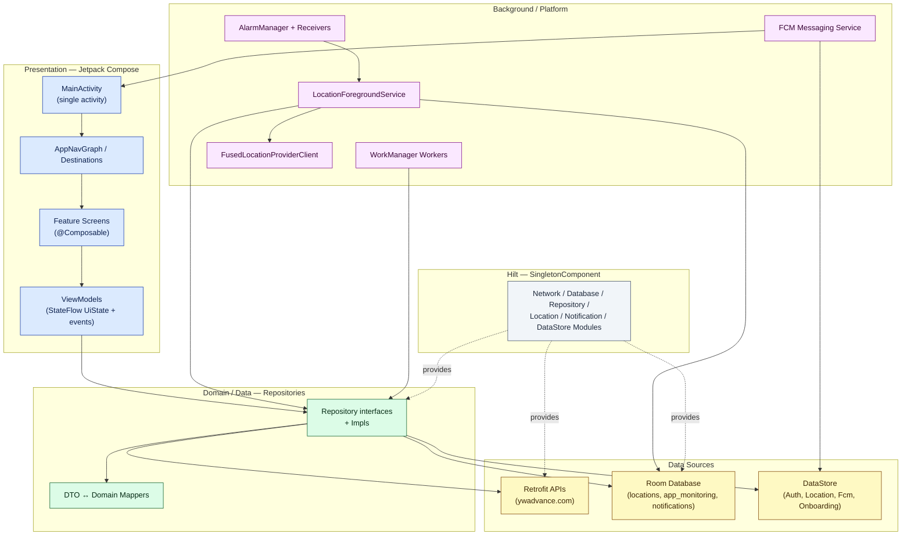

**Layering rule:** UI → ViewModel → Repository (interface) → Data source. ViewModels never touch
Retrofit, Room, or DataStore directly; repositories own all mapping between DTOs and domain models.

---

## 4. Package / Module Structure

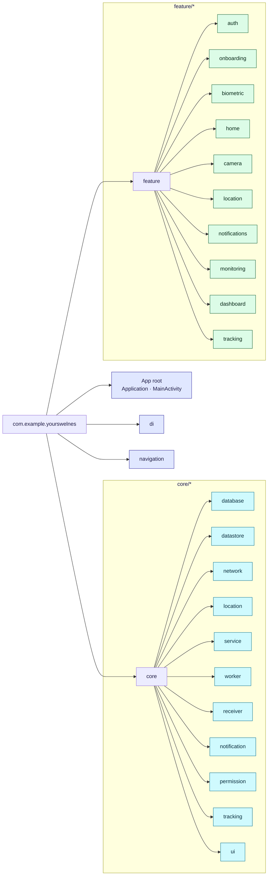

---

## 5. Screen Navigation Flow

`AppNavGraph` is a single `NavHost` with `startDestination = "splash"`. Transitions are disabled
(`EnterTransition.None`) for an instant feel. The **Requirements gate** and **Permission wizard**
are re-entrant guards that can interrupt `HOME` on every `ON_RESUME`.

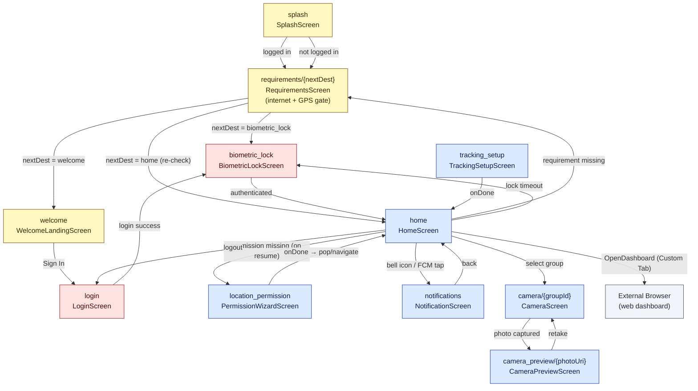

### Destinations reference

| Route | Screen | Arguments |
|---|---|---|
| `splash` | SplashScreen | — |
| `requirements/{nextDest}` | RequirementsScreen | `nextDest: String` |
| `welcome` | WelcomeLandingScreen | — |
| `login` | LoginScreen | — |
| `biometric_lock` | BiometricLockScreen | — |
| `home` | HomeScreen | — |
| `location_permission` | PermissionWizardScreen | — |
| `tracking_setup` | TrackingSetupScreen | — |
| `notifications` | NotificationScreen | — |
| `camera/{groupId}` | CameraScreen | `groupId: Long` |
| `camera_preview/{photoUri}` | CameraPreviewScreen | `photoUri: String (encoded)` |

---

## 6. MVVM Relationships

Every screen follows the same contract: the **ViewModel** exposes an immutable `StateFlow<UiState>`
plus a `Flow` of one-shot navigation events; the **Composable** is stateless and calls ViewModel
methods. `hiltViewModel()` supplies each ViewModel.

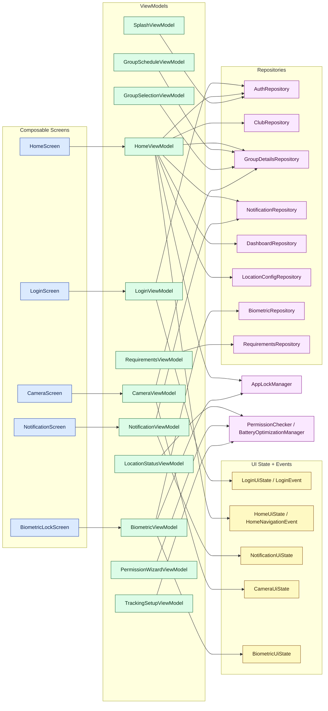

### ViewModel → Repository matrix

| ViewModel | Repositories / Managers |
|---|---|
| `LoginViewModel` | AuthRepository |
| `SplashViewModel` | AuthRepository |
| `HomeViewModel` | AuthRepository, ClubRepository, NotificationRepository, DashboardRepository, LocationConfigRepository, GroupDetailsRepository, AppLockManager |
| `GroupScheduleViewModel` | GroupDetailsRepository |
| `NotificationViewModel` | NotificationRepository |
| `CameraViewModel` | GroupDetailsRepository (+ CameraX) |
| `GroupSelectionViewModel` | GroupDetailsRepository |
| `BiometricViewModel` | BiometricRepository, AppLockManager |
| `LocationStatusViewModel` | PermissionChecker / BatteryOptimizationManager |
| `RequirementsViewModel` | RequirementsRepository |
| `PermissionWizardViewModel` | BatteryOptimizationManager, PermissionChecker |
| `TrackingSetupViewModel` | BatteryOptimizationManager, PermissionChecker |

---

## 7. Repository & Data Source Flow

```mermaid
graph TD
    subgraph Repositories
        AUTH["AuthRepositoryImpl"]
        CLUB["ClubRepositoryImpl"]
        GROUP["GroupDetailsRepositoryImpl"]
        DASH["DashboardRepositoryImpl"]
        LCFG["LocationConfigRepositoryImpl"]
        LREC["LocationRepositoryImpl"]
        NOTIF["NotificationRepositoryImpl"]
        MON["AppMonitoringRepositoryImpl"]
        BIO["BiometricRepositoryImpl"]
        REQ["RequirementsRepositoryImpl"]
    end

    subgraph Retrofit["Retrofit APIs"]
        A_AUTH["AuthApi"]
        A_CLUB["ClubApi"]
        A_GROUP["GroupDetailsApi"]
        A_DASH["DashboardApi"]
        A_LOC["LocationApi"]
        A_NOTIF["NotificationApi"]
        A_MON["AppMonitoringApi"]
    end

    subgraph RoomDB["Room DAOs"]
        D_LOC["LocationDao"]
        D_NOTIF["NotificationDao"]
        D_MON["AppMonitoringDao"]
    end

    subgraph DataStore["DataStore"]
        P_AUTH["AuthPreferences"]
        P_LOC["LocationPreferences"]
        P_FCM["FcmPreferences"]
        P_ONB["PermissionOnboarding"]
    end

    AUTH --> A_AUTH
    AUTH --> P_AUTH
    AUTH --> P_FCM
    CLUB --> A_CLUB
    CLUB --> P_LOC
    GROUP --> A_GROUP
    GROUP --> P_AUTH
    DASH --> A_DASH
    DASH --> P_AUTH
    LCFG --> A_LOC
    LCFG --> P_LOC
    LREC --> D_LOC
    NOTIF --> A_NOTIF
    NOTIF --> D_NOTIF
    NOTIF --> P_AUTH
    MON --> A_MON
    MON --> D_MON
    MON --> P_AUTH
    BIO --> SYS["BiometricManager (system)"]
    REQ --> SYS2["Connectivity / LocationManager (system)"]

    classDef repo fill:#fae8ff,stroke:#86198f,color:#3b0738;
    classDef api fill:#fef9c3,stroke:#854d0e,color:#3b2503;
    classDef room fill:#cffafe,stroke:#0e7490,color:#083344;
    classDef ds fill:#dcfce7,stroke:#166534,color:#052e16;
    class AUTH,CLUB,GROUP,DASH,LCFG,LREC,NOTIF,MON,BIO,REQ repo;
    class A_AUTH,A_CLUB,A_GROUP,A_DASH,A_LOC,A_NOTIF,A_MON api;
    class D_LOC,D_NOTIF,D_MON room;
    class P_AUTH,P_LOC,P_FCM,P_ONB ds;
```

**Pattern:** Repositories with both an API and a DAO use **offline-first** semantics — write to Room
first, sync to the network opportunistically (notifications, app monitoring, location records).
Config repositories cache the latest server values into DataStore so background services can read
them with zero network dependency.

---

## 8. Authentication Flow

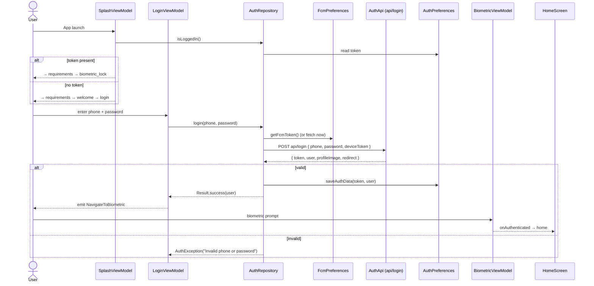

**Token attachment:** After login, every subsequent request carries the bearer token automatically:

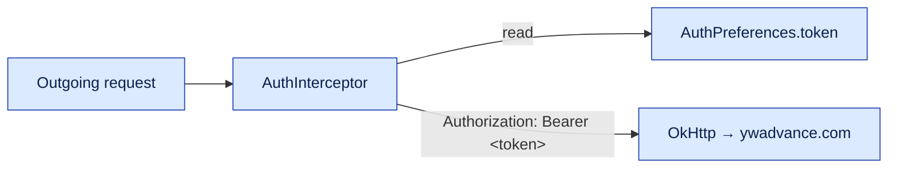

**App-lock:** `AppLockManager` (singleton) records background time on `MainActivity.onStop()`.
On `onStart()`, if more than `LOCK_TIMEOUT_MS` (60 s) elapsed, it sets `isLockRequired = true`,
which `HomeViewModel` observes and routes to `biometric_lock`. There is no server logout endpoint —
logout is client-side (clear DataStore) per `AuthApi` docs.

---

## 9. API & Firebase Interactions

### REST endpoints (base `https://ywadvance.com/`)

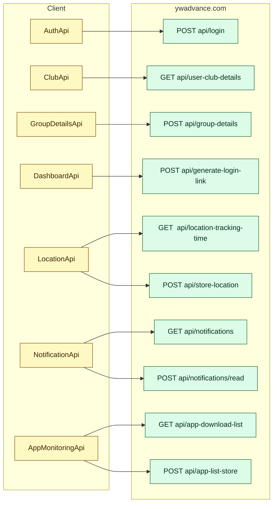

### Firebase Cloud Messaging flow

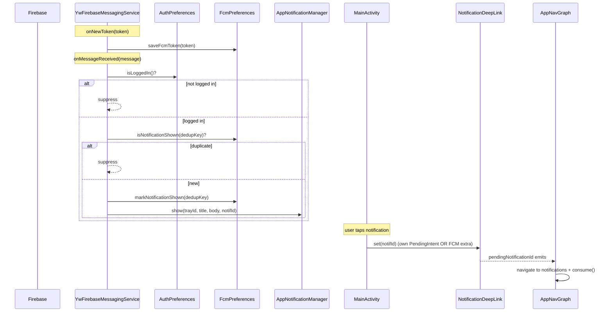

> **Payload note (verified on-device):** the backend frequently sends pushes **without**
> `notification_id` in the FCM data block. The service never rejects a push for missing it — it
> falls back to title/body keys and uses the FCM `messageId` as the dedup key.

---

## 10. Database / Entity Relationships

Room database `yourswelnes.db`, **version 6**, three independent tables (no foreign keys — each
table is scoped per-user via a `user_id` column).

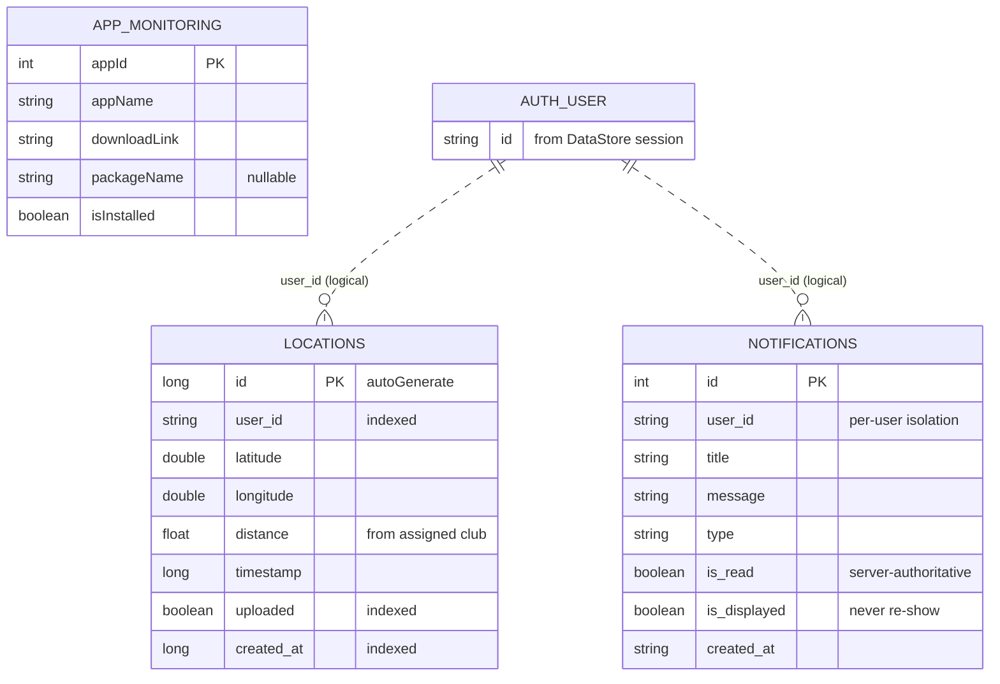

> `AUTH_USER` is **not** a Room table — the logged-in user lives in `AuthPreferences` (DataStore).
> `user_id` columns are logical foreign keys enforced in DAO queries so User A's rows never appear
> for User B on a shared device.

### Migration history

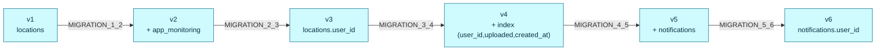

### Key DAO operations

| DAO | Notable queries |
|---|---|
| `LocationDao` | `getPendingLocations(userId, limit)` (uploaded=0, batched), `markAsUploaded(ids)`, `deleteUploaded()` |
| `NotificationDao` | `getAllForUser`, `getUndisplayedForUser`, `markRead`, `markDisplayed`, IGNORE-insert (never re-show) |
| `AppMonitoringDao` | `getAll()` (Flow), `replaceAll()` (txn delete+insert) |

---

## 11. Background / Location Tracking Architecture

This is the heart of the app — a multi-layered, **offline-first, Doze-resistant** pipeline designed
so collection survives overnight, OEM battery kills, reboots, and network loss.

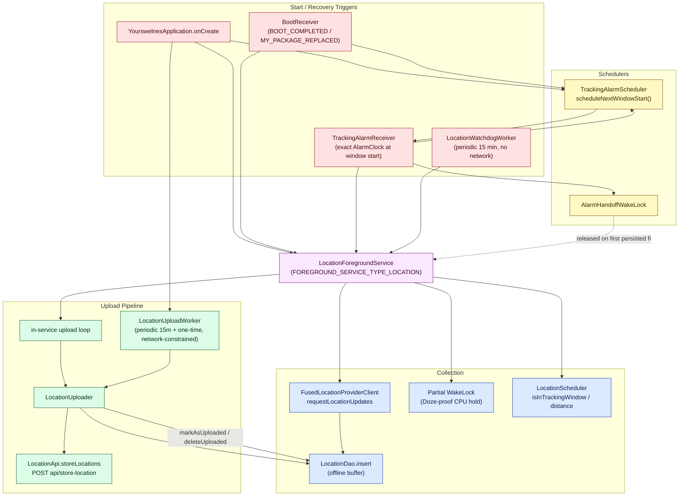

### WorkManager workers

| Worker | Schedule | Purpose |
|---|---|---|
| `LocationUploadWorker` | Periodic 15 min + one-time | Drain pending Room rows → `api/store-location` (network-constrained) |
| `LocationWatchdogWorker` | Periodic 15 min (no network) | Restart FGS if OEM killed it during an active window |
| `ScheduleSyncWorker` | Periodic 30 min | Refresh tracking-time config from backend |
| `AppInstallationSyncWorker` | Periodic + one-time | Reconcile installed apps → `api/app-list-store` |
| `BackupTrackingWorker` | One-time (delayed) | Belt-and-braces tracking re-arm |
| `NotificationSyncWorker` | Cancelled (FCM replaces polling) | Legacy notification poll, now disabled |

### Platform components (AndroidManifest)

| Component | Type | Trigger |
|---|---|---|
| `LocationForegroundService` | Service (`location` type) | App boot, alarm, watchdog |
| `YwFirebaseMessagingService` | Service | `com.google.firebase.MESSAGING_EVENT` |
| `BootReceiver` | Receiver | `BOOT_COMPLETED`, `MY_PACKAGE_REPLACED` |
| `TrackingAlarmReceiver` | Receiver | Exact alarm at tracking-window start |

---

## 12. Feature Breakdown

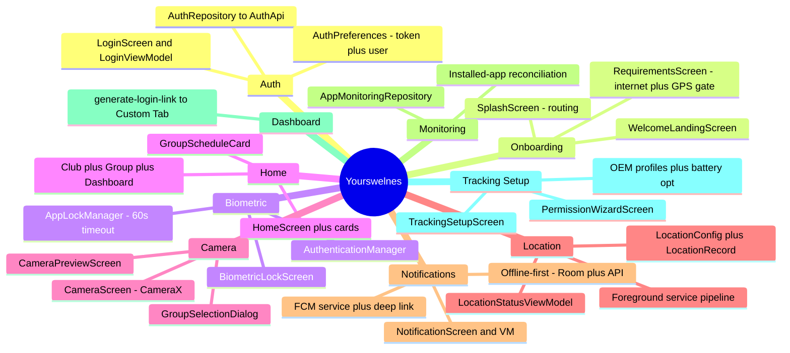

### Feature summaries

- **auth** — Phone + password login; attaches FCM device token; persists session in DataStore.
- **onboarding** — Splash decides initial route; Requirements gate enforces internet + GPS on every
  resume; Welcome is the unauthenticated landing.
- **biometric** — Foreground app-lock with a 60 s background timeout; biometric/device-credential prompt.
- **home** — Aggregates club details, group schedules, dashboard link, notifications; the central hub
  that also enforces the mandatory-permission contract on every `ON_RESUME`.
- **camera** — CameraX capture scoped to a selected group, with a preview/retake step.
- **location** — Surfaces tracking status & permission health; owns the config/record models that the
  foreground service consumes.
- **notifications** — Offline-first list (Room cache + REST), driven by FCM pushes with dedup + deep link.
- **monitoring** — Tracks which monitored apps are installed and reports status to the backend.
- **dashboard** — Requests a one-time login link and opens the web dashboard in a Custom Tab.
- **tracking** — Permission wizard + OEM-specific battery-optimization setup that guarantees the
  tracking pipeline can run reliably.

---

## 13. Dependency Injection (Hilt) Setup

All modules install into `SingletonComponent`. The app uses `@HiltAndroidApp`,
`@AndroidEntryPoint` (Activity, services), and `@HiltViewModel` + `@AssistedInject` workers via
`HiltWorkerFactory`.

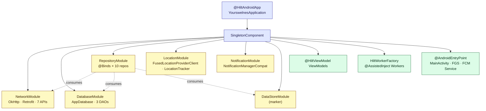

| Module | Binding style | Provides |
|---|---|---|
| `NetworkModule` | `@Provides` | `HttpLoggingInterceptor`, `OkHttpClient`, `Retrofit`, and all 7 `*Api` interfaces |
| `DatabaseModule` | `@Provides` | `AppDatabase` (+5 migrations) and `LocationDao`, `NotificationDao`, `AppMonitoringDao` |
| `RepositoryModule` | `@Binds` | 10 repository interfaces → impls (Auth, Club, Dashboard, LocationConfig, Location, Notification, GroupDetails, AppMonitoring, Biometric, Requirements) |
| `LocationModule` | `@Provides` | `FusedLocationProviderClient`, `LocationTracker` ← `FusedLocationTracker` |
| `NotificationModule` | `@Provides` | `NotificationManagerCompat` |
| `DataStoreModule` | marker | DataStores are `@Singleton @Inject constructor` (auto-provided) |

---

## 14. Data Flow Explanation

### Read path (e.g. Home loading club + notifications)
1. `HomeScreen` collects `HomeViewModel.uiState` (a `StateFlow<HomeUiState>`).
2. `HomeViewModel` calls repositories (`ClubRepository`, `NotificationRepository`, …).
3. Each `*RepositoryImpl` reads its cache (Room/DataStore) and/or calls a `*Api` via Retrofit.
4. `AuthInterceptor` injects the bearer token from `AuthPreferences` into the request.
5. DTOs are mapped to domain models (`*Mapper`), returned as `Result<T>`.
6. The ViewModel folds results into a new immutable `HomeUiState`; Compose recomposes.

### Write path (location capture → upload)
1. `LocationForegroundService` registers continuous `FusedLocationProviderClient` updates inside the
   tracking window, holding a Doze-proof partial wake lock.
2. Each fix is mapped to a `LocationRecord` and **written to Room first** (`LocationDao.insert`) — the
   offline buffer. Upload never blocks collection.
3. The in-service upload loop **and** `LocationUploadWorker` independently drain pending rows:
   `getPendingLocations` → `LocationUploader` → `LocationApi.storeLocations` → `markAsUploaded` →
   `deleteUploaded`.
4. If offline, rows stay `uploaded = 0` and are retried on the next tick or when connectivity returns.

### Event path (one-shot navigation)
ViewModels emit navigation as a `Flow` of sealed events (`LoginEvent`, `HomeNavigationEvent`,
`SplashNavigationEvent`). `AppNavGraph` collects them in `LaunchedEffect` and performs `navController`
operations — keeping navigation out of UI state and immune to recomposition replays.

---

## 15. Architecture Observations

**Strengths**
- **Clean feature-first MVVM** with a strict UI → ViewModel → Repository → DataSource boundary; no
  data-source leakage into the UI.
- **Consistent UDF contract**: immutable `StateFlow` state + separate one-shot event flows everywhere.
- **Genuinely robust background story**: layered recovery (exact alarm + watchdog worker + START_STICKY
  + boot receiver), Doze-proof wake-lock handling, and an offline-first Room buffer make tracking
  resilient to OEM battery managers, reboots, and network loss.
- **Strong multi-user hygiene**: every per-user table filters by `user_id`, so accounts sharing a
  device cannot see each other's data.
- **Idempotent FCM handling**: dedup keys + `is_displayed` flag prevent duplicate/re-shown notifications.
- **Hilt** used idiomatically, including `@AssistedInject` workers via `HiltWorkerFactory`.

**Considerations / watch-items**
- The package namespace is still `com.example.yourswelnes` while the applicationId is
  `com.yourwelnes.yourswelnes` — harmless but worth aligning before long-term maintenance.
- Single Gradle module — fine at current size, but the clear `feature/*` + `core/*` split would
  modularize cleanly (`:feature:x`, `:core:y`) if build times or team scale demand it.
- `LocationForegroundService` is large and orchestrates collection, config refresh, upload, wake
  locks, and GPS-state UX. It is well-commented, but extracting the upload loop / window-management
  into collaborators would ease testing.
- Two parallel upload paths (in-service loop **and** `LocationUploadWorker`) provide redundancy by
  design; both funnel through `LocationUploader`/`LocationDao`, so they are safe but should stay in
  sync if upload logic changes.
- No server-side logout/refresh endpoints; session lifecycle is entirely client-managed via DataStore.

---

*Generated by static analysis of the `:app` module source tree. All Mermaid diagrams use standard
`graph`, `sequenceDiagram`, `erDiagram`, and `mindmap` syntax and are self-contained.*
